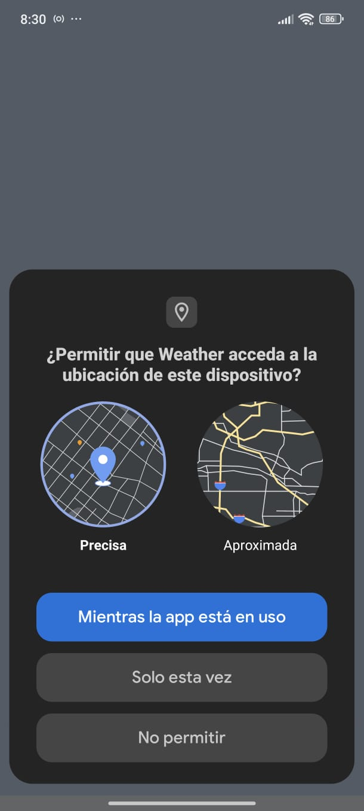
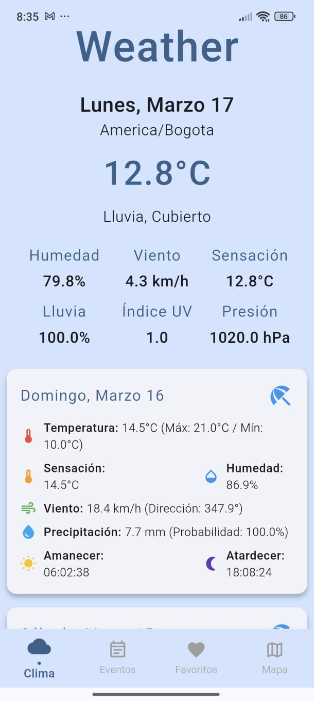
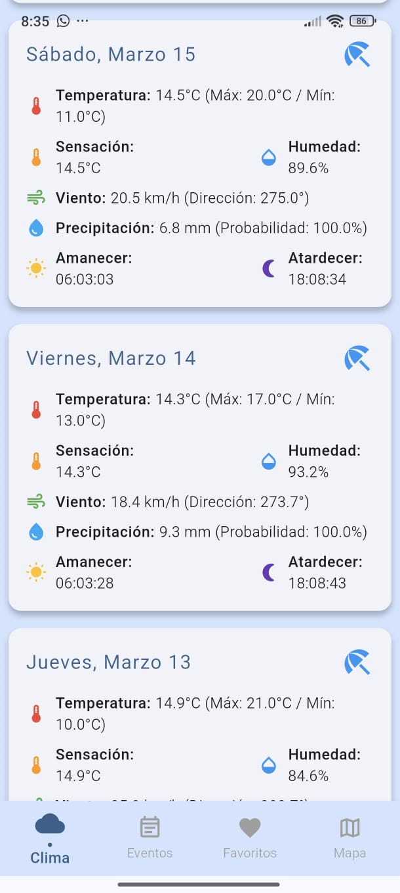
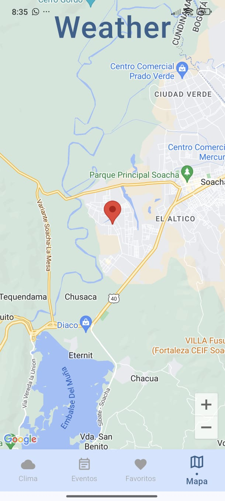
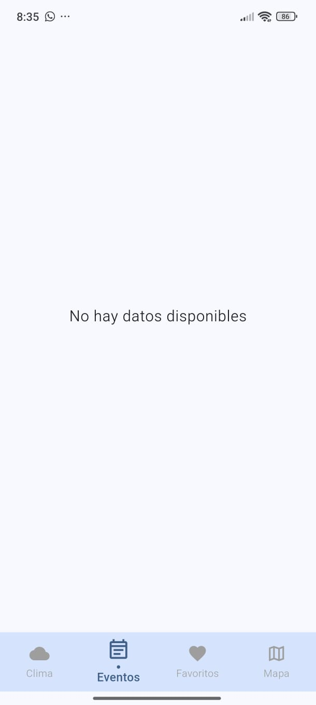
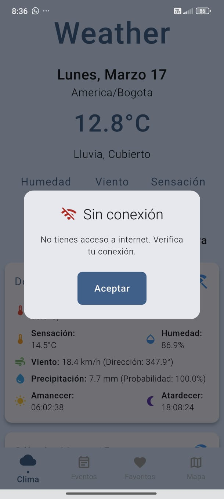

# Weather App - Prueba Técnica Flutter

 Es una aplicación móvil desarrollada en Flutter que permite a los usuarios consultar información detallada sobre el clima y eventos meteorológicos basados en su ubicación o en una localización ingresada manualmente. La aplicación está diseñada para ofrecer una experiencia fluida y funcional, tanto en línea como fuera de línea, con características como la gestión de favoritos, notificaciones de eventos y soporte para múltiples ambientes (dev y prod) mediante el uso de flavors.

La aplicación obtiene datos meteorológicos y eventos climáticos de la API de VisualCrossing, presentando la información en español y utilizando el sistema métrico. Además, se incluyen funcionalidades avanzadas como el almacenamiento local de datos (usando Realm), notificaciones en tiempo real (con Riverpod) y un modo offline que permite a los usuarios acceder a la última información cargada incluso sin conexión a Internet.

## 📷 Capturas de Pantalla

<table>
  <tr>
    <td>
      
      <p><strong>Permiso para usar ubicación</strong></p>
    </td>
    <td>
      
      <p><strong>Información del día de hoy</strong></p>
    </td>
  </tr>
  <tr>
    <td>
      
      <p><strong>Información de los últimos días</strong></p>
    </td>
    <td>
      
      <p><strong>Ubicación del dispositivo en el mapa</strong></p>
    </td>
  </tr>
  <tr>
    <td>
      
      <p><strong>Eventos</strong></p>
    </td>
    <td>
      
      <p><strong>Sin conexión</strong></p>
    </td>
</table>

## 🚀 Características Principales

### 📌 Módulos o Pantallas

#### ⛅ Pronóstico de los Últimos 5 Días
- Muestra el clima actual y el pronóstico diario de los últimos 5 días.

#### 🌪️ Eventos Climáticos
- Muestra información detallada sobre eventos meteorológicos como granizo, tornados, vientos fuertes y terremotos.

#### ⭐ Favoritos
- Permite a los usuarios agregar y eliminar eventos climáticos como favoritos.

#### 🗺️ Mapa
- Muestra las coordenadas de la ubicación seleccionada en un mapa interactivo.

#### 📴 Modo Offline
- Notifica al usuario cuando no hay conexión a Internet.
- Muestra la última información cargada, almacenada localmente en **Realm**.


## 🚀 Instalación y Configuración

### Requisitos previos

- **Flutter 3.29.0**
- **Dart 3.7.0**
- Dependencias instaladas con `flutter pub get`.

### Instalación

1. Clonar el repositorio:
   ```bash
   git clone https://github.com/frguerrerogo/weather.git
   cd weather
   ```

2. Configuración de variables de entorno

    - Crea un archivo `.env` en la raíz del proyecto.
    - Agrega las siguientes claves de API:

       ```bash
      # .env.example
      WEATHER_API_KEY=TU_CLAVE_AQUI
      GOOGLE_API_KEY=TU_CLAVE_AQUI
      ```

2. Instalar dependencias:
   ```bash
   flutter pub get
   ```
3. Ejecutar la aplicación:
    - Para ejecutar la aplicación en modo desarrollo (Dev), usa:
        ```bash
        flutter run --flavor dev -t lib/main.dart
        ```
    - Para ejecutar la aplicación en modo producción (Production), usa:
        ```bash
        flutter run --flavor prod -t lib/main.dart
        ```
    - Depuración en Visual Studio Code

        El proyecto está configurado para soportar la depuración con los ambientes 'Dev' y 'Prod' desde 'Run and Debug' en Visual Studio Code.
3. Ejecutar la aplicación:

      ```bash
   flutter test
   ```


## 🎨 Flavors (Ambientes)

La aplicación cuenta con dos flavors para gestionar diferentes ambientes:

### 🛠️ Dev
- Icono y nombre personalizados para el ambiente de desarrollo.
- Recursos específicos para pruebas y depuración.

### 🚀 Prod
- Icono y nombre personalizados para el ambiente de producción.
- Configuraciones optimizadas para el lanzamiento oficial.

## 📂 Estructura del Código

Este proyecto sigue una arquitectura modular basada en Clean Architecture, separando las capas de presentación, dominio y datos, lo que facilita la escalabilidad y el mantenimiento.

- core/ → Configuraciones generales, inyección de dependencias, temas y utilidades globales.
- data/ → Implementación de fuentes de datos (APIs, realm) y repositorios concretos.
- domain/ → Definición de entidades, repositorios abstractos y casos de uso.
- presentation/ → UI, lógica de estado con Cubit/Bloc, pantallas y widgets reutilizables.

Esta estructura permite un flujo limpio y desacoplado, facilitando la gestión de cambios y nuevas funcionalidades.

```
lib/
│
├── /app
│   ├── /core
│   │   ├── /config
│   │   │   ├── /di
│   │   │   │   ├── dependency_injector.dart
│   │   │   │   └── dependency_injector.g.dart
│   │   │   ├── /flavors
│   │   │   │   └── flavors.dart
│   │   │   ├── /router
│   │   │   │   ├── app_router.dart
│   │   │   │   ├── app_routes.dart
│   │   │   │   └── screen_builders.dart
│   │   │   ├── app_constants.dart
│   │   │   ├── app_text_styles.dart
│   │   │   ├── app_theme.dart
│   │   │   ├── app_utils.dart
│   │   │   └── index.dart
│   │   └── /utils
│   │       ├── /cubits
│   │       │   └── index.dart
│   │       └── /screens
│   │           └── index.dart
│   │
│   ├── /data
│   │   ├── /core
│   │   │   ├── /adapter
│   │   │   │   ├── adapter.dart
│   │   │   │   └── index.dart
│   │   │   ├── /datasources
│   │   │   │   ├── /local
│   │   │   │   │   ├── realm_datasource.dart
│   │   │   │   │   └── index.dart
│   │   │   │   └── /remote
│   │   │   │       ├── /apis
│   │   │   │       │   ├── api_utils.dart
│   │   │   │       │   └── weather_api.dart
│   │   │   │       └── index.dart
│   │   │   ├── /models
│   │   │   │   └── index.dart
│   │   │   ├── /realm
│   │   │   │   └── index.dart
│   │   │   └── /repositories
│   │   │       └── index.dart
│   │   └── /weather
│   │       ├── /adapters
│   │       ├── /datasources
│   │       ├── /models
│   │       ├── /realms
│   │       └── /repositories
│   │
│   ├── /domain
│   │   ├── /core
│   │   │   ├── /entities
│   │   │       └── index.dart
│   │   │   └── /repositories
│   │   │       └── index.dart
│   │   └── /weather
│   │       ├── /entities
│   │       └── /repositories
│   │
│   └── /presentation
│       ├── /core
│       │   ├── /providers
│       │   │   └── index.dart
│       │   ├──/screens
│       │   │   └── index.dart
│       │   └── /widgets
│       │       └── index.dart
│       └── /weather
│           ├── /events
│           │   ├── /providers
│           │   └── /screens
│           ├── /favorites
│           │   ├── /providers
│           │   └── /screens
│           ├── /home
│           │   ├── /providers
│           │   └── /screens
│           ├── /weather
│           │   ├── /providers
│           │   │   ├── weather_notifier.dart
│           │   │   ├── weather_provider.dart
│           │   │   └── weather_state.dart
│           │   └── /screens
│           │       └── weather_screen.dart
│           └── /widgets
│
├── main.dart
└── README.md
```

## 🔥 Tecnologías Usadas

- **Flutter**: Framework principal.
- **Riverpod**: Gestión de estado.
- **Kiwi**: Inyección de dependencias.
- **GoRoute**: Navegación.
- **Realm**: Base de datos local.
- **HTTP**: Cliente HTTP para APIs.
- **Json Annotation**: Serialización/deserialización de JSON.
- **Permission Handler**: Manejo de permisos.
- **Google Maps**: Uso de mapas.
- **Geolocator**: Obtención de ubicación.
- **Connectivity Plus**: Verificación de conexión a Internet.
- **Intl**: Internacionalización y formatos.
- **Flutter Test**: Pruebas unitarias y de integración.

## 👤 Autor y Contacto

**Desarrollador**: Fabian Guerrero

Para preguntas o soporte, puedes contactarme en:

- **Email**: [frguerrerogo@gmail.com](frguerrerogo@gmail.com)
- **LinkedIn**: [frguerrerogo](https://www.linkedin.com/in/frguerrerogo/)